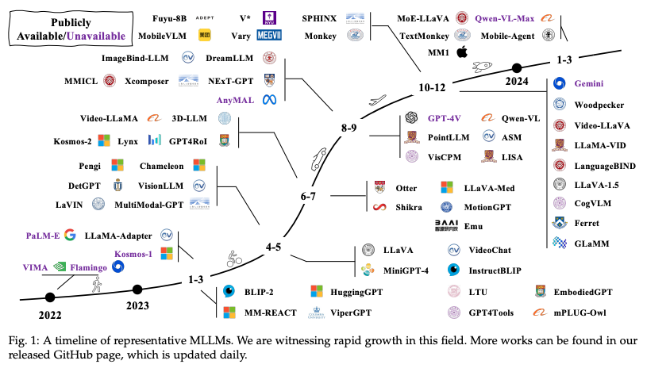
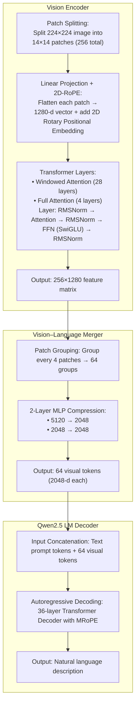

# Qwen-VL-Models-Insights

## 概要

Qwen-VLに関する最新の研究や関連情報をまとめたリポジトリです。とくに日本語に関するタスクへの応用を中心に扱っています。

## 大規模マルチモーダルモデルとは

引用：A Survey on Multimodal Large Language Models

### 大規模マルチモーダルモデル分野の急速な成長と多様化

GPT‑4V公開で一気に研究加速し、2024年前半に、多機能化・多領域化が急拡大しました。

### モデル構造

主に以下の３つのパーツで構成されます：

1. encoder
CLIP や EVA-CLIP、ConvNeXt-L などのビジョンまたは音声モデルが生データを特徴ベクトルに変換。
2.  LLM
GPT 系やLLaMA 系、Qwen 系などの大規模言語モデルがテキストの理解・生成を担当。
3. connector
Encoder の出力を LLM が扱える形式に変換。代表的な方式に MLP、Q-Former、Multi-Head Attention ベースがあります

現在は、学習済みの Encoder と LLM を繋ぎ、Connector が両者を橋渡しするアーキテクチャが主流です。

## Qwen2.5-VL

引用：Qwen2.5-VL Technical Report

### Qwen2.5‑VL の構成

1. Large Language Model (LLM)
2. Vision Encoder
3. MLP-based Vision-Language Merger

### 感想

Qwen 2.5‑VL では、Windowed Attention や MLPベースの Merger による特徴圧縮、RMSNorm といった工夫で計算コストを大幅に削減しています。また、改良版 RoPE を導入し、より合理的なEmbeddingで性能を向上させています。

224×224画像入力時の処理フロー：

1. LLM
    - 従来の1D RoPE(Rotary Position Embedding) からMRoPE(multimodal Rotary Posiiton Embedding)に変更
        - RoPE: token間の相対距離をrotary embeddingし、長文でも位置情報を正確に伝える仕組み。
        - MRoPE: 時間・空間を含む多軸tokenの相対位置をrotary embeddingし、マルチモーダル入力でも位置関係を正確に維持する仕組み。
2. Vision Encoder
    - windowed attention
        - Full Attentionはすべてのpatch間で注意をかけて画像全体の依存関係を計算することに対して、windowed attentionはpatchだけに注意をかけて計算することによって、計算量を抑えます。
    - 2D-RoPE
        - 画像内パッチの水平・垂直位置をrotary embeddingし、visual tokenの相対空間関係を保持する。
    - RMSNorm
        - 平均値計算を省略しつつ安定した正規化を提供し、演算速度とメモリ効率を改善します。
    - SwiGLU
        - GLU のゲート機構と Swish 活性化を組み合わせ、重要な信号を選び取りつつ滑らかな出力変換で学習を安定化します。
3. MLP-based Vision-Language Merger
    - Merger は画像patch特徴を統合・圧縮して一定数の視覚tokenに変換します。これによりdecoderへの入力長を一定に保ち、マルチモーダル情報を効率よく統合します。

### pre-training

1. Interleaved Image-Text Data
    
    画像と文章が一組になったデータを大量に収集し、基本クリーニングを実施した後に、独自モデルで 文章品質、画像‑文章の関連度、 情報の補完性、情報量バランスをスコアリングし、高得点サンプルだけを採用。
    
2. Grounding Data with Absolute Position Coordinates 
    - 画像はリサイズせず原画素のまま入力し、バウンディングボックスやポイントをピクセル単位の絶対座標で記録。
    - 実際のサイズ感・位置関係をそのまま学習できるため、高精度な物体検出・位置特定が可能に。
3. Document Omni-Parsing Data 
    - 段落（`
`）、表（`<table>`）、グラフ、数式、キャプション、OCRテキスト、楽譜、化学式などをすべてHTMLタグ＋`bbox`属性で統一。
    - 従来別モデルで分担していたレイアウト解析・テキスト抽出・図表理解を、単一のVLMで一括処理できるように。
4. OCR Data 
    
    合成データと実写データを組み合わせ、多言語・多フォント・多シーンの文字認識サンプルを大規模に収集・整備。
    
5. Video Data 
    
    動的 FPS サンプリングと絶対時間に揃えた MRoPE を導入し、数秒〜数時間の動画をネイティブ解像度で学習。
    
6. Agent Data
    
    モバイル／Web／デスクトップのUIスクリーンショットと、それを操作する一連の関数呼び出し（function‑call）ステップをChain‑of‑Thought付きで学習
    

### 感想

日本語の読み取りタスクでは、Qwen 2 から大きな構造変更がないのに性能が大きく伸びている印象があります。事前学習については、論文だけではどんなデータをどう使って学習したのかハッキリつかめませんが、日本語OCRデータを増やしたことが大きく寄与しているのではないでしょうか。

### Post-training

1. Instruction Data
    
    半分は画像・動画付き、半分はテキストのみで、対話形式の命令フォーマットとしてモデルに提示。
    
2. Data Filtering Pipeline
    
    ドメイン別分類し、評価モデルで採点し、点数が低いノイズや冗長サンプルを除去
    
3. Rejection Sampling for Enhanced Reasoning
    
    中間モデルで生成した Chain‑of‑Thought 推論結果をGTと照合し、一致した高品質サンプルのみを残す。
    
4. DPO (Direct Preference Optimization)
    
    DPOはRLHFと同等の性能を示しており、よりシンプルなDPOを選択するメリットが大きい。
    

## ファインチューニング

wip

## 量子化

wip

## デプロイ

wip

## Qwen-VL関連モデル・派生モデル

### olmOCR: Unlocking Trillions of Tokens in PDFs with Vision Language Models

**概要：**

複雑なレイアウトを持つドキュメントでも、正しい読み順でテキストを抽出できるVLMです。

**モデル：** 

Qwen2‑VL‑7B‑Instruct をベースモデルにしています。

**学習データ：**

25万ページ分のPDF画像を用い、GPT‑4oで生成したテキストをラベルとして学習に利用しました。

**学習手法：**

PyPDF を用いて文字ブロックや画像の座標情報を抽出し、{x, y, width, height} 付きのテキストと共にページをレンダリングした画像を入力としてQwen2‑VLをファインチューニングを行います。LoRAとフルパラメータファインチューニング両方実施し、フルパラメータの方が精度が高いとの結果が報告されました。

**感想：**

ドキュメント・アンカリングにより文字情報だけでなくレイアウト情報も学習に取り込むことで、PDF抽出の精度が向上しました。モデル自体の構造変更は行わず、追加情報のみで性能改善を実現しています。ただし、学習ラベルを GPT 生成データに依存しているため、商用利用についてはライセンスや生成データの扱いに注意が必要だと考えます。

実際に日本語ドキュメントで検証したところ、複雑な表組みや細かいレイアウトも正確に抽出できることが確認できました。ただし、日本語 PDF に対する追加学習は行われていないため、文字認識そのものの精度は Qwen2‑VL のベースモデルと大きく変わらない印象です。また、スキャンした PDF には座標情報が含まれないため、こうした非デジタル文書については Qwen2‑VL と同等の性能に留まると理解しています。

---

**OmniSVG: A Unified Scalable Vector Graphics Generation Model**

WIP